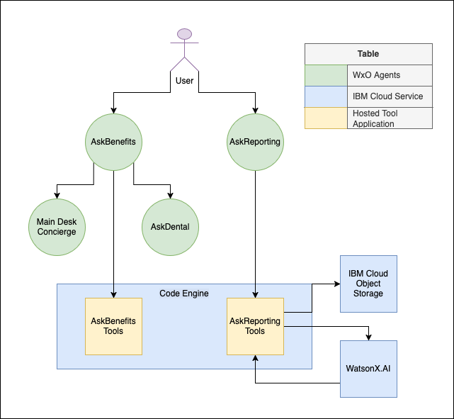

# 🏥 AskBenefits

As healthcare systems grow more complex, patients often struggle to access accurate, timely information about their medical and dental benefits. Navigating legacy systems, finding overdue care information, and retrieving historical claims can be time-consuming. With IBM watsonx Orchestrate, we can now design agentic systems that unify data retrieval, document-based reasoning, and task execution.

---

## 🤔 The Problem

HealthPlan Corp, a national healthcare provider, faces challenges in streamlining member services and benefits inquiries. Traditional systems scatter information across claims data, plan summaries, and customer service touchpoints. Members struggle to find historical procedure data, learn about upcoming care requirements, and access relevant documents like 1095 forms. Support representatives are overwhelmed, and patient satisfaction is declining.

---

## 🎯 Objective

This use case demonstrates how to build an AI-powered AskBenefits agent in IBM watsonx Orchestrate. The agent addresses healthcare-specific member queries using reasoning, document ingestion, and OpenAPI-connected tooling.

In this lab, you will:

- Build an AskBenefits agent to help members query medical procedures, overdue care, and plan specifics.
- Create a companion AskDental agent that answers questions from uploaded dental policy documents.
- Orchestrate multi-agent collaboration between AskBenefits and AskDental for seamless member support.

---

## 📈 Business Value

Deploying a virtual benefits assistant improves the member experience through:

- Reduced wait times and call center load
- Personalized, step-by-step answers for medical and dental questions
- Unified support from document-based and API-based sources
- Increased satisfaction through accurate, proactive responses
- Scalable automation of claims review and appointment tasks

---

## 🏛️ Architecture

To deliver a seamless healthcare support experience, this architecture uses watsonx Orchestrate to build three intelligent agents:

1. **AskBenefits** — Interacts with structured data via OpenAPI tools for plan coverage, historical procedures, and overdue care.
2. **AskDental** — Extracts insights from uploaded PDFs using document QA techniques.
3. **AskReporting** — Generates care reports summarizing financial details and reprocessing statuses for claims.

Together, they provide comprehensive health benefits assistance via AI-driven orchestration.

### Architecture Components

- **IBM watsonx Orchestrate Agents**: Central orchestrators for healthcare questions and document retrieval.
- **Watsonx Assistant (optional)**: Supplements agent interactions with concierge-like capabilities.
- **OpenAPI Tooling**: Connects agents with medical claims and procedure records.
- **Document-Based QA**: Supports extraction from uploaded PDF knowledge.

---

## 📄 Hands-on step-by-step lab

Please find the step-by-step instructions [here](/README.md) to build, connect, and deploy your healthcare agents.
