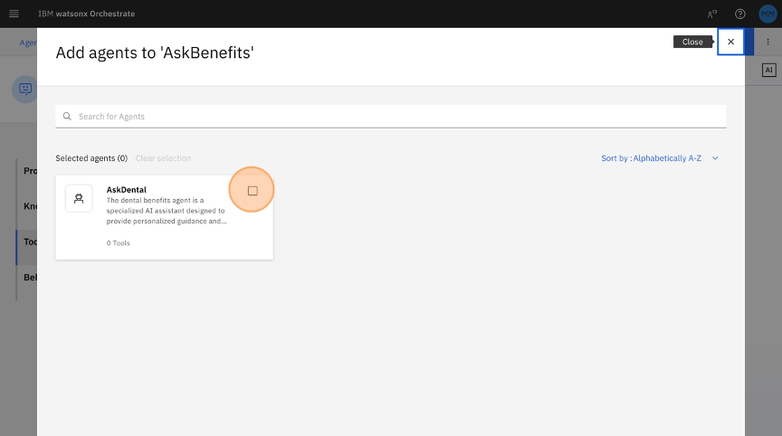
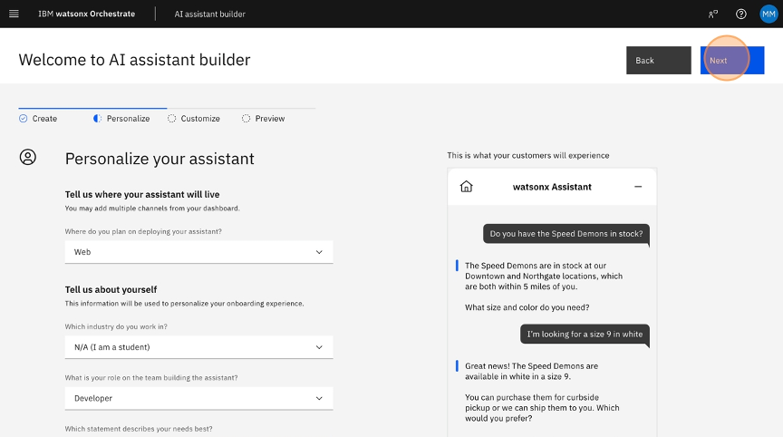

# IBM Watsonx Orchestrate AskBenefits Agent - Setup Guide

This guide walks you through the complete process of creating, configuring, and deploying agents within IBM Watsonx Orchestrate (WxO). By following this step-by-step guide with visual instructions, you'll learn how to build an AI-powered healthcare assistant capable of accurately responding to benefits-related inquiries.

## Table of Contents
- [Lab Overview](#lab-overview)
- [Agents Overview](#agents-overview)
- [Lab Objective](#lab-objective)
- [Use Case Description](#use-case-description)
- [Architecture Diagram](#architecture-diagram)
- [Prerequisites](#prerequisites)
- [AskBenefits Step-by-Step Instructions](#askbenefits-step-by-step-instructions)
  - [1. Accessing IBM Watsonx Orchestrate](#1-accessing-ibm-watsonx-orchestrate)
  - [2. Creating a New Agent](#2-creating-a-new-agent)
  - [3. Importing and Attaching Tools](#3-importing-and-attaching-tools)
  - [4. Deploying and Testing the Agent](#4-deploying-and-testing-the-agent)
- [AskDental Step-by-Step Instructions](#askdental-step-by-step-instructions)
  - [1. Identifying Knowledge Gaps](#1-identifying-knowledge-gaps)
  - [2. Creating a New Collaborator Agent](#2-creating-a-new-collaborator-agent)
  - [3. Importing and Exposing Knowledge Documents](#3-importing-and-exposing-knowledge-documents)
  - [4. Integrating AskDental as a Collaborator](#4-integrating-askdental-as-a-collaborator)
- [Testing Scenarios](#testing-scenarios)
- [Incorporating a WatsonX Assistant (Optional)](#incorporating-a-watsonx-assistant)
  - [1. Creating a new WatsonX Assistant](#1-creating-a-new-watsonx-assistant)
  - [2. Importing the Pre-Made Action](#2-importing-the-pre-made-action)
  - [3. Publishing the Assistant](#3-publishing-the-assistant)
  - [4. Getting Assistant Variables](#4-getting-assistant-variables)
  - [5. Generating an API Key](#5-generating-an-api-key)
  - [6. Importing the Assistant](#6-importing-the-assistant)
- [Secondary Testing Scenarios](#secondary-testing-scenarios)
- [AskReporting Step-by-Step Instructions (Optional)](#askreporting-step-by-step-instructions)
  - [1. Create AskReporting](#1-create-askreporting)
  - [3. Importing and Attaching Tools](#2-importing-and-attaching-tools)
  - [3. Switching to and Testing the Agent](#3-switching-to-and-testing-the-agent)
- [Final Testing Scenarios](#final-testing-scenarios)

---

## Use Case Description

This use case focuses on developing and deploying an AskBenefits agent using IBM watsonx Orchestrate, as illustrated in the accompanying architecture. The agent enables users to interact with healthcare systems through conversational AI to access personalized benefits information. In this lab, you will build the AskBenefits agent from scratch, integrating external tools via OpenAPI to retrieve medical history, identify overdue care, and provide upcoming procedure guidance. You'll also create a companion AskDental agent that references uploaded documents to answer dental coverage questions, and configure both agents to collaborate, showcasing a multi-agent orchestration pattern for comprehensive healthcare support.

---

## Architecture Diagram

  

---

## Prerequisites

* An active IBM Cloud account
* Access to IBM Watsonx Orchestrate environment
* The OpenAPI specification file (`openapi-tools-spec.json`)
* The benefits file (`dental_benefits_summary.pdf`)
* The optional WatsonX Assistant action file (`main-desk-concierge-action-v1.json`)
* The optional reporting OpenAPI specification file  (`openapi-tools-report.json`)

---

## AskBenefits Step-by-Step Instructions

### 1. Accessing IBM Watsonx Orchestrate

1. Navigate to [https://cloud.ibm.com/](https://cloud.ibm.com/)

   

2. Click on the menu icon in the top left corner

   

3. Select "Watson Orchestrate-itz"

   

4. Click "Launch watsonx Orchestrate"

   

5. Click on the hamburger menu icon in the top left

   

6. Click on "Build"

   

7. Select "Agent Builder"

   

### 2. Creating a New Agent

1. Click "Create agent"

   

2. In the "Name*" field, enter:
   ```
   AskBenefits
   ```

   

3. In the "Description*" field, enter:
   ```
   A proactive healthcare assistant designed to guide users through questions related to medical procedures and health plan benefits. The agent classifies each inquiry as pertaining to a past, future, or overdue medical procedure and selects the most appropriate tool accordingly. It can retrieve historical data, identify overdue care, offer guidance on upcoming procedures, or provide plan-specific details such as coverage and pharmacy benefits. When necessary, it can also assist in scheduling appointments. The assistant reasons step-by-step, selects tools based strictly on user intent, avoids redundant calls, and responds with professionalism, clarity, and empathy.
   ```

   

4. Click "Create" to initialize your agent

   

### 3. Importing and Attaching Tools

1. Click "Add tool"

   

2. Select "Import an external tool."

   

3. Click on the upload area labeled "Drag and drop OpenAPI files here or click to upload."

   

4. Upload the file containing the OpenAPI specification file: `openapi-tools-spec.json`  (Note: `openapi-tools-spec.yaml` is also available if issues are encountered with file uploads)

5. Click "Next"

   

6. Click "Select all rows in the table" to select all available tools

   

7. Click "Done"

   

### 4. Deploying and Testing the Agent

1. In the "Type something..." field enter the following and hit enter
   ```
   Can you give me a cost breakdown for X rays?
   ```

   


2. Click "Deploy" to activate your AskBenefits agent

   

3. Click on the menu icon in the top left corner

   

4. Click on "Chat" 

   

---

## AskDental Step-by-Step Instructions

### 1. Identifying Knowledge Gaps

1. In the "Type something..." field enter the following and hit enter
   ```
   Can you describe my dental benefits?
   ```

   

### 2. Creating a New Collaborator Agent

1. Click on the hamburger menu icon in the top left

   

2. Click on "Build"

   

3. Select "Agent Builder"

   

4. Click "Create agent"

   

5. In the "Name*" field, enter:
   ```
   AskDental
   ```

   

6. In the "Description*" field, enter:
   ```
   The dental benefits agent is a specialized AI assistant designed to provide personalized guidance and support to policyholders, helping them navigate their dental coverage and make informed decisions about their oral health care. By analyzing individual policy details and dental needs, the agent answers questions about coverage.
   ```

   

7. Click "Create" to initialize your agent

   

### 3. Importing and Exposing Knowledge Documents

1. Click "Upload files" under "Knowledge

   

2. Upload the file containing Dental Benefit information: `dental_benefits_summary.pdf`

   

3. Click "Upload"

   

4. In the Knowledge Description field with "Example: This knowledge addresses all order-related inquiries. Customers can seek guidance on order status, shipping details, return policies, product availability, and refund processes." enter:
   ```
   This knowledge file explains dental benefits and can be used to answer questions to policyholders. Contains information about individual policy details and coverage. If the answer to the question is not contained in your knowledge base, instead of responding you should initiate a transfer to the supervisor agent, copying the users query verbatim.
   ```

   

5. Click "Deploy"

   

### 4. Integrating AskDental as a Collaborator

1. Click on the hamburger menu icon in the top left

   

2. Click on "Build"

   

3. Select "Agent Builder"

   

4. Select "AskBenefits"

   

5. Click "Add Agent" under "Agents"

   

6. Select "Add from local instance"

   

7. Select "AskDental"

   

8. Click "Add to agent"

   

9. Click "Deploy"

   

10. Click on the menu icon in the top left corner

   

11. Click on "Chat" 

   

12. In the "Type something..." field enter the following and hit enter
   ```
   Can you describe my dental benefits?
   ```

   

---

## Testing Scenarios

After successful deployment, test the AskBenefits agent with the following sample prompts to verify functionality across different healthcare scenarios:

1. **Procedure Cost Breakdown:**
   ```
   Can you give me a cost breakdown for X rays?
   ```

2. **Historical Procedure Review:**
   ```
   What procedures have we had at City Hospital in the last year?
   ```

3. **Preventive Care Alerts:**
   ```
   Are we overdue for any procedures?
   ```

4. **Appointment Scheduling:**
   ```
   Can you schedule an appointment for next Thursday at 10 AM?
   ```

5. **Document Access:**
   ```
   Thanks, how do I access my 1095 form again?
   ```

6. **Dental Document Question Answering:**
   ```
   Can you describe my dental benefits?
   ```


---

## Incorporating a WatsonX Assistant

### 1. Creating a new WatsonX Assistant

1. Click on the hamburger menu icon in the top left

   
   ```

2. Click on "Build"

   

3. Click on "Assistant Builder"

   


4. In the "Assistant Name" field enter
   ```
   Main Desk Concierge
   ```
   

5. Click on "Next"

   

6. Select the "Web" option.

   

7. Select the "N/A (I am a student)" option.

   

8. Select the "Developer" option.

   

9. Select the "I’m using the product to complete a course or certification" option.

   

10. Click on "Next"

   

11. Type "Main Desk Concierge"

   

12. Click on "Next"

   

13. Click "Create"

   

### 2. Importing the Pre-Made Action

1. Click "Actions"

   

2. Click on "Global Settings"

   

3. Click "Upload/Download"

   

4. Click "Drag and drop file here or click to select a file" and upload `Main-Desk-Concierge-action.json`

   

5. Click on "Upload"

   

6. Click "Upload and replace"

   

7. Click on "Close"

   

### 3. Publishing the Assistant

1. Click "Publish"

   

2. Click "Publish"

   

3. In the "Example: Updated "Business hours" action" field enter:
   ```
   First draft
   ```
   

4. Click "Choose environment"

   

5. Click "Live"

   

6. Click "Publish"

   

### 4. Getting Assistant Variables

1. Click "Assistant settings"

   

2. Click "View details"

   

3. Copy "Service Instance URL", "Assistant ID", "Live Environment ID" to a note on your machine

   

   

   

### 5. Generating an API Key

1. In a new tab, navigate to https://cloud.ibm.com/

2. Click "Manage"

   

3. Click "Access (IAM)"

   
   
4. Click "API keys"

   

5. Click "Create"

   

6. In "Name" field enter:
   ```
   wxo_key
   ```

7. Click "Create"

   

8. Copy API Key to Note on your local machine

   

### 6. Importing the Assistant

1. Switch to tab WatsonX Orchestrate tab.

2. Click on the hamburger menu icon in the top left

   

3. Click on "Build"

   

4. Select "Agent Builder"

   

5. Select "AskBenefits"

   

6. Click "Add Agent" under "Agents"

   

7. Click "Import and register an external agent."

   

8. Click "External watsonx Assistant"

   

9. Click "Next"

   

10. Copy "API Key", "Environment ID", "Assistant ID", "Service Instance URL" into the respective fields from your local
   

   

   

   

11. In the "Version" field enter:
   ```
   2024-08-25
   ```
   

12. In the "Display name" field enter:
   ```
   Main Desk
   ```
   

13. In the "Description" field enter:
   ```
   This assistant collects necessary user information when they need to access their medical records
   ```
   

14. Click "Import agent"
   
   

15. Click "Deploy"

   

---

## Secondary Testing Scenarios

After successful deployment, test the AskBenefits agent with the following sample prompts to verify functionality with the includeded Main Desk Assistant:

1. **Initiate Main Desk Assistant:**
   ```
   I need to access my medical history 
   ```

2. **Provide Name:**
   ```
   Charlie Smith
   ```

3. **Provide Date of Birth:**
   ```
   03-04-2013
   ```

4. **Previous Procedure Query:**
   ```
   When did I have my last vision exam?
   ```

5. **Follow-up on Previous Procedure Query:**
   ```
   and where was it?
   ```

---

## AskReporting Step-by-Step Instructions

### 1. Create AskReporting

1. Click on the hamburger menu icon in the top left

   

2. Click on "Build"

   

3. Select "Agent Builder"

   

4. Click "Create agent"

   

5. In the "Name*" field, enter:
   ```
   AskReporting
   ```

   

6. In the "Description*" field, enter:
   ```
   This agent is responsible for generating care reports that summarize the status and outcomes of healthcare claims. It reviews structured claim data and related correspondence to produce a clear, accessible summary of each claim’s history, current status, and resolution path. The generated reports highlight key financial details, adjustments, patient responsibility, and any reprocessing actions (e.g., appeals, denials, or approvals). These reports are optimized for use by providers, payers, and care coordinators to support transparency and decision-making.
   ```

   

7. Click "Create" to initialize your agent

   

### 2. Importing and Attaching Tools

1. Click "Add tool"

   

2. Select "Import an external tool."

   

3. Click on the upload area labeled "Drag and drop OpenAPI files here or click to upload."

   

4. Upload the file containing the OpenAPI specification file: `openapi-tools-report.json`

5. Click "Next"

   

6. Click "Select all rows in the table" to select all available tools

   

7. Click "Done"

   

2. Click "Deploy" to activate your AskReporting agent

   

### 3. Switching to and Testing the Agent

1. Click on the menu icon in the top left corner

   

2. Click on "Chat" 

   

3. Click "AskBenefits" Dropdown

   

4. Select "AskReporting" 

   

---

## Final Testing Scenarios

After successful deployment, test the AskReporting agent with the following sample prompts to verify functionality, clicking the generated urls to view reports:

1. **Ask for a Default Report:**
   ```
   Please create a care report
   ```

2. **Ask for a Custom Report:**
   ```
   Please create a care report with an additional section that translates the email from the provider into layman terms 
   ```
